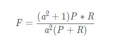
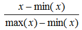

# Machine-Learning-Note(机器学习笔记)

* [机器学习“判定模型”和“生成模型”有什么区别？](https://github.com/dapsjj/Machine-Learning-Note#机器学习判定模型和生成模型有什么区别)
* [理解支持向量机](https://github.com/dapsjj/Machine-Learning-Note#理解支持向量机)
* [理解随机森林](https://github.com/dapsjj/Machine-Learning-Note#理解随机森林)
* [理解KNN](https://github.com/dapsjj/Machine-Learning-Note#理解knn)
* [有监督学习、无监督学习、半监督学习的区别](https://github.com/dapsjj/Machine-Learning-Note#有监督学习无监督学习半监督学习的区别)
* [有监督学习建模步骤](https://github.com/dapsjj/Machine-Learning-Note#有监督学习建模步骤)
* [常用分类算法优缺点对比](https://github.com/dapsjj/Machine-Learning-Note#常用分类算法优缺点对比)
* [分类算法的评估方法](https://github.com/dapsjj/Machine-Learning-Note#分类算法的评估方法)
* [哪些机器学习算法不需要做归一化处理？](https://github.com/dapsjj/Machine-Learning-Note#哪些机器学习算法不需要做归一化处理)
* [树形结构为什么不需要归一化？](https://github.com/dapsjj/Machine-Learning-Note#树形结构为什么不需要归一化)
* [欧氏距离和曼哈顿距离区别](https://github.com/dapsjj/Machine-Learning-Note#欧氏距离和曼哈顿距离区别)
* [逻辑回归介绍](https://github.com/dapsjj/Machine-Learning-Note#逻辑回归介绍)

## 机器学习“判定模型”和“生成模型”有什么区别？
假设我们有两类动物，大象（y = 1）和狗（y = 0）。而X是动物的特征向量。

给定训练集，诸如逻辑回归或支持向量机算法之类的算法会尝试找到一条将大象和狗分开的直线（即决策边界）。然后，要将新动物归类为大象或狗，它会检查它落在决策边界的哪一侧，并据此做出预测。我们称这些判别学习算法。p(y|x)条件概率。

另一种方法，首先，看看大象，我们可以建立一个大象长什么样的模型。然后，查看狗，我们可以为狗的外观建立一个单独的模型。最后，要对新动物进行分类，我们可以将新动物与大象模型进行匹配，并与狗模型进行匹配，以查看新动物看起来更像大象还是更像我们在训练集中看到的狗。我们称这些生成学习算法。p(x,y)联合概率。

## 理解支持向量机
形式上，支持向量机在高维或无限维空间中构建一个超平面或一组超平面，可用于分类，回归或其他任务。
直观地，通过超平面可以实现良好的分离，该超平面与任何类别的最近训练数据点之间的距离最大（所谓的功能裕量），因为通常裕量越大，分类器分类器的泛化误差就越小。

通常与“内核函数”一起使用，本质上是对有效地使空间非线性化的标准内部产品的替代。这大致相当于从你的空间到应用线性分类器的某个“工作空间”中进行非线性变换，然后将结果拉回到您的原始空间，在该原始空间中，分类器使用的线性子空间不再是线性的。

支持向量机使用内核函数将数据隐式映射到可以线性分离的特征空间中：

## 理解随机森林
在机器学习中，随机森林是一个包含多个决策树的分类器， 并且其输出的类别是由个别树输出的类别的众数而定。(少数服从多数)

随机森林的构建过程：
1. 假如有N个样本，则有放回的随机选择N个样本(每次随机选择一个样本，然后返回继续选择)。这选择好了的N个样本用来训练一个决策树，作为决策树根节点处的样本。
2. 当每个样本有M个属性时，在决策树的每个节点需要分裂时，随机从这M个属性中选取出m个属性，满足条件m < M。然后从这m个属性中采用某种策略（比如说信息增益）来选择1个属性作为该节点的分裂属性。
3. 决策树形成过程中每个节点都要按照步骤2来分裂（很容易理解，如果下一次该节点选出来的那一个属性是刚刚其父节点分裂时用过的属性，则该节点已经达到了叶子节点，无须继续分裂了）。一直到不能够再分裂为止。注意整个决策树形成过程中没有进行剪枝。
4. 按照步骤1~3建立大量的决策树，这样就构成了随机森林了。

例子：
我要到杭州旅游，刚好我有3个杭州的朋友，我让他们推荐景点，A推荐西湖、灵隐寺，B推荐西湖、南宋御街，C推荐西湖、雷峰塔。
大家都推荐西湖，那我一定得去西湖溜达溜达。这就是典型的随机森林的例子。

优点：

1）对于很多种资料，它可以产生高准确度的分类器；

2）它可以处理大量的输入变数；

3）它可以在决定类别时，评估变数的重要性；

4）在建造森林时，它可以在内部对于一般化后的误差产生不偏差的估计；

5）它包含一个好方法可以估计遗失的资料，并且，如果有很大一部分的资料遗失，仍可以维持准确度；

6）它提供一个实验方法，可以去侦测variable interactions；

7）对于不平衡的分类资料集来说，它可以平衡误差；

8）它计算各例中的亲近度，对于数据挖掘、侦测离群点（outlier）和将资料视觉化非常有用；

9）使用上述。它可被延伸应用在未标记的资料上，这类资料通常是使用非监督式聚类。也可侦测偏离者和观看资料；

10）学习过程是很快速的。

## 理解KNN
一、KNN算法概述

　　邻近算法，或者说K最近邻(KNN，K-NearestNeighbor)分类算法是数据挖掘分类技术中最简单的方法之一。所谓K最近邻，就是K个最近的邻居的意思，说的是每个样本都可以用它最接近的K个邻居来代表。Cover和Hart在1968年提出了最初的邻近算法。KNN是一种分类(classification)算法，它输入基于实例的学习（instance-based learning），属于懒惰学习（lazy learning）即KNN没有显式的学习过程，也就是说没有训练阶段，数据集事先已有了分类和特征值，待收到新样本后直接进行处理。与急切学习（eager learning）相对应。
  
　　KNN是通过测量不同特征值之间的距离进行分类。 
  
　　思路是：如果一个样本在特征空间中的k个最邻近的样本中的大多数属于某一个类别，则该样本也划分为这个类别。KNN算法中，所选择的邻居都是已经正确分类的对象。该方法在定类决策上只依据最邻近的一个或者几个样本的类别来决定待分样本所属的类别。
  
　　提到KNN，网上最常见的就是下面这个图，可以帮助大家理解。
  
　　我们要确定绿点属于哪个颜色（红色或者蓝色），要做的就是选出距离目标点距离最近的k个点，看这k个点的大多数颜色是什么颜色。当k取3的时候，我们可以看出距离最近的三个，分别是红色、红色、蓝色，因此得到目标点为红色。
  

算法的描述：

　　1）计算测试数据与各个训练数据之间的距离
  
　　2）按照距离的递增关系进行排序
  
　　3）选取距离最小的K个点
  
　　4）确定前K个点所在类别的出现频率
  
　　5）返回前K个点中出现频率最高的类别作为测试数据的预测分类

二、关于K的取值

　　K：临近数，即在预测目标点时取几个临近的点来预测。
  
　　K值得选取非常重要，因为：
  
　　如果当K的取值过小时，一旦有噪声得成分存在们将会对预测产生比较大影响，例如取K值为1时，一旦最近的一个点是噪声，那么就会出现偏差，K值的减小就意味着整体模型变得复杂，容易发生过拟合。
  
　　如果K的值取的过大时，就相当于用较大邻域中的训练实例进行预测，学习的近似误差会增大。这时与输入目标点较远实例也会对预测起作用，使预测发生错误。K值的增大就意味着整体的模型变得简单。
  
　　如果K==N的时候，那么就是取全部的实例，即为取实例中某分类下最多的点，就对预测没有什么实际的意义了。
  
　　K的取值尽量要取奇数，以保证在计算结果最后会产生一个较多的类别，如果取偶数可能会产生相等的情况，不利于预测。

K的取法：

 　　常用的方法是从k=1开始，使用检验集估计分类器的误差率。重复该过程，每次K增值1，允许增加一个近邻。选取产生最小误差率的K。
   
　　一般k的取值不超过20，上限是n的开方，随着数据集的增大，K的值也要增大。

三、关于距离的选取

　　距离就是平面上两个点的直线距离
  
　　关于距离的度量方法，常用的有：欧几里得距离、余弦值（cos）, 相关度 （correlation）, 曼哈顿距离 （Manhattan distance）或其他。
  
　　Euclidean Distance 定义：
  
　　两个点或元组P1=（x1，y1）和P2=（x2，y2）的欧几里得距离是:
  
  
  
   距离公式为：（多个维度的时候是多个维度各自求差）
   
   
    
四、特点

  优点：
  
  1）思想简单，理论成熟，既可以用来做分类也可以用来做回归
  
  2）可用于非线性分类
  
  3）训练时间复杂度为O(n)
  
  4）准确度高，对数据没有假设，对outlier不敏感

  缺点：
  
  1）计算量太大
  
  2）对于样本分类不均衡的问题，会产生误判
  
  3）需要大量的内存
  
  4）输出的可解释性不强
  
  
  ## 有监督学习、无监督学习、半监督学习的区别
  监督学习：给小朋友一本有课后答案的习题册，让小朋友自己做题，并自己校对答案。
  无监督学习：比如参加一些开放性的竞赛（比如：数学建模竞赛），出题人只给出题目。参赛者，需要根据题目找出结构和规则，才能解题。（在没有老师的情况下，学生自学的过程。学生在学习的过程中，自己对知识进行归纳、总结。无监督学习中，类似分类和回归中的目标变量事先并不存在。要回答的问题是“从数据X中能发现什么”。）
  半监督学习：家教，家教老师给学生讲一两道例题思路，然后给学生布置没有答案的课后习题，让学生课后自己完成。

  监督学习是最常见的一种机器学习，它的训练数据是有标签的，训练目标是能够给新数据（测试数据）以正确的标签。
  例如，想让AI知道什么是猫什么是狗，一开始我们先将一些猫的图片和狗的图片（带标签）一起进行训练，学习模型不断捕捉这些图片与标签间的联系进行自我调整和完善，然后我们给一些不带标签的新图片，让该AI来猜猜这些图片是猫还是狗。
  经典的算法：支持向量机、回归、决策树、朴素贝叶斯

  无监督学习常常被用于数据挖掘，用于在大量无标签数据中发现些什么。它的训练数据是无标签的，训练目标是能对观察值进行分类或者区分等。相对于监督学习，无监督学习使用的是没有标签的数据。机器会主动学习数据的特征，并将它们分为若干类别，相当于形成「未知的标签」。
  非监督性学习是只给特征，没有给标签，就是高考前的一些模拟试卷，是没有标准答案的，也就是没有参照是对还是错，但是我们还是可以根据这些问题之间的联系将语文、数学、英语分开。
  通常无监督学习是指不需要人为注释的样本中抽取信息。例如word2vec。
  经典的算法：k-means、PCA等；

  半监督学习介于两者之间。算法上，包括一些对常用监督式学习算法的延伸，这些算法首先试图对未标识数据进行建模，在此基础上再对标识的数据进行预测。隐藏在半监督学习下的基本规律在于：数据的分布必然不是完全随机的，通过一些有标签数据的局部特征，以及更多没标签数据的整体分布，就可以得到可以接受甚至是非常好的分类结果。（此处大量忽略细节）
  例如：很多实际问题中，只有少量的带有标记的数据，因为对数据进行标记的代价有时很高。比如找到照片并给照片上的猫标上标签（lable）很麻烦，但是猫的各种姿势的猫片网上一搜一大堆。那我们能不能手动标记一部分猫片，然后让AI学习训练，然后再剩下没标记的猫片上做实验呢？
  经典算法：S3VM半监督支持向量机

## 有监督学习建模步骤
  监督学习是使用已知正确答案的示例来训练网络，每组训练数据有一个明确的标识或结果。想象一下，我们可以训练一个网络，让其从照片库中（其中包含气球的照片）识别出气球的照片。以下就是我们在这个假设场景中所要采取的步骤。

  步骤1：数据集的创建和分类 ​   
  首先，浏览你的照片（数据集），确定所有包含气球的照片，并对其进行标注。然后，将所有照片分为训练集和验证集。目标就是在深度网络中找一函数，这个函数输入是任意一张照片，当照片中包含气球时，输出1，否则输出0。

  步骤2：数据增强（Data Augmentation） ​   
  当原始数据搜集和标注完毕，一般搜集的数据并不一定包含目标在各种扰动下的信息。数据的好坏对于机器学习模型的预测能力至关重要，因此一般会进行数据增强。对于图像数据来说，数据增强一般包括，图像旋转，平移，颜色变换，裁剪，仿射变换等。

  步骤3：特征工程（Feature Engineering） ​   
  一般来讲，特征工程包含特征提取和特征选择。常见的手工特征(Hand-Crafted Feature)有尺度不变特征变换(Scale-Invariant Feature Transform, SIFT)，方向梯度直方图(Histogram of Oriented Gradient, HOG)等。由于手工特征是启发式的，其算法设计背后的出发点不同，将这些特征组合在一起的时候有可能会产生冲突，如何将组合特征的效能发挥出来，使原始数据在特征空间中的判别性最大化，就需要用到特征选择的方法。在深度学习方法大获成功之后，人们很大一部分不再关注特征工程本身。因为，最常用到的卷积神经网络(Convolutional Neural Networks, CNN)本身就是一种特征提取和选择的引擎。研究者提出的不同的网络结构、正则化、归一化方法实际上就是深度学习背景下的特征工程。

  步骤4：构建预测模型和损失 ​   
  将原始数据映射到特征空间之后，也就意味着我们得到了比较合理的输入。下一步就是构建合适的预测模型得到对应输入的输出。而如何保证模型的输出和输入标签的一致性，就需要构建模型预测和标签之间的损失函数，常见的损失函数(Loss Function)有交叉熵、均方差等。通过优化方法不断迭代，使模型从最初的初始化状态一步步变化为有预测能力的模型的过程，实际上就是学习的过程。

  步骤5：训练 ​     
  选择合适的模型和超参数进行初始化，其中超参数比如支持向量机中核函数、误差项惩罚权重等。当模型初始化参数设定好后，将制作好的特征数据输入到模型，通过合适的优化方法不断缩小输出与标签之间的差距，当迭代过程到了截止条件，就可以得到训练好的模型。优化方法最常见的就是梯度下降法及其变种，使用梯度下降法的前提是优化目标函数对于模型是可导的。

  步骤6：验证和模型选择 ​   
  训练完训练集图片后，需要进行模型测试。利用验证集来验证模型是否可以准确地挑选出含有气球在内的照片。在此过程中，通常会通过调整和模型相关的各种事物（超参数）来重复步骤2和3，诸如里面有多少个节点，有多少层，使用怎样的激活函数和损失函数，如何在反向传播阶段积极有效地训练权值等等。

  步骤7：测试及应用 ​   
  当有了一个准确的模型，就可以将该模型部署到你的应用程序中。你可以将预测功能发布为API（Application Programming Interface, 应用程序编程接口）调用，并且你可以从软件中调用该API，从而进行推理并给出相应的结果。

## 常用分类算法优缺点对比
|算法|优点|缺点|
|:-|:-|:-|
|Bayes 贝叶斯分类法|1）所需估计的参数少，对于缺失数据不敏感。 2）有着坚实的数学基础，以及稳定的分类效率。|1）需要假设属性之间相互独立，这往往并不成立。（喜欢吃番茄、鸡蛋，却不喜欢吃番茄炒蛋）。 2）需要知道先验概率。 3）分类决策存在错误率。|
|Decision Tree决策树|1）不需要任何领域知识或参数假设。 2）适合高维数据。 3）简单易于理解。 4）短时间内处理大量数据，得到可行且效果较好的结果。 5）能够同时处理数据型和常规性属性。|1）对于各类别样本数量不一致数据，信息增益偏向于那些具有更多数值的特征。 2）易于过拟合。 3）忽略属性之间的相关性。 4）不支持在线学习。|
|SVM支持向量机|1）可以解决小样本下机器学习的问题。 2）提高泛化性能。 3）可以解决高维、非线性问题。超高维文本分类仍受欢迎。 4）避免神经网络结构选择和局部极小的问题。|1）对缺失数据敏感。 2）内存消耗大，难以解释。 3）运行和调参略烦人。|
|KNN K近邻|1）思想简单，理论成熟，既可以用来做分类也可以用来做回归；  2）可用于非线性分类；  3）训练时间复杂度为O(n)；  4）准确度高，对数据没有假设，对outlier不敏感；|1）计算量太大。 2）对于样本分类不均衡的问题，会产生误判。 3）需要大量的内存。 4）输出的可解释性不强。|
|Logistic Regression逻辑回归|1）速度快。 2）简单易于理解，直接看到各个特征的权重。 3）能容易地更新模型吸收新的数据。 4）如果想要一个概率框架，动态调整分类阀值。|特征处理复杂。需要归一化和较多的特征工程。|
|Neural Network 神经网络|1）分类准确率高。 2）并行处理能力强。 3）分布式存储和学习能力强。 4）鲁棒性较强，不易受噪声影响。|1）需要大量参数（网络拓扑、阀值、阈值）。 2）结果难以解释。 3）训练时间过长。|
|Adaboosting|1）adaboost是一种有很高精度的分类器。 2）可以使用各种方法构建子分类器，Adaboost算法提供的是框架。 3）当使用简单分类器时，计算出的结果是可以理解的。而且弱分类器构造极其简单。 4）简单，不用做特征筛选。 5）不用担心overfitting。|对outlier比较敏感|

## 分类算法的评估方法

评价指标列表

基本概念

针对一个二分类问题，即将实例分成正类（positive）或负类（negative），在实际分类中会出现以下四种情况：  
（1）若一个实例是正类，并且被预测为正类，即为真正类(True Positive TP)  
（2）若一个实例是正类，但是被预测为负类，即为假负类(False Negative FN)  
（3）若一个实例是负类，但是被预测为正类，即为假正类(False Positive FP)  
（4）若一个实例是负类，并且被预测为负类，即为真负类(True Negative TN)  

准确率(Accuracy)  
定义：对于给定的测试数据集，分类器正确分类的样本数与总样本数之比。  
计算公式：  

缺点：在正负样本不平衡的情况下，这个指标有很大的缺陷。例如：给定一组测试样本共1100个实例，其中1000个是正类，剩余100个是负类。即使分类模型将所有实例均预测为正类，Accuracy也有90%以上，这样就没什么意义了。

精确率(Precision)、召回率(Recall)和F1值  
精确率和召回率是广泛用于信息检索和统计学分类领域的两个度量值，用来评价结果的质量。其中：  
精确率是检索出相关文档数与检索出的文档总数的比率（正确分类的正例个数占分类为正例的实例个数的比例），衡量的是检索系统的查准率。  
  

召回率是指检索出的相关文档数和文档库中所有的相关文档数的比率（正确分类的正例个数占实际正例个数的比例），衡量的是检索系统的查全率。  
  

为了能够评价不同算法优劣，在Precision和Recall的基础上提出了F1值的概念，来对Precision和Recall进行整体评价。F1的定义如下：  
  

我们当然希望检索结果（分类结果）的Precision越高越好，同时Recall也越高越好，但事实上这两者在某些情况下有矛盾的。比如极端情况下，我们只搜索出了一个结果，且是准确的（分类后的正确实例只有一个，且该实例原本就是正实例），那么Precision就是100%，但是Recall就会很低；而如果我们把所有结果都返回（所有的结果都被分类为正实例），那么Recall是100%，但是Precision就会很低。因此在不同的场合中需要自己判断希望Precision比较高还是Recall比较高。如果是做实验研究，可以绘制Precision-Recall曲线来帮助分析。

综合评价指标F-Measure  
Precision和Recall指标有时候会出现矛盾的情况，这样就需要综合考虑他们，最常见的方法就是F-Measure（又称为F-Score）。F-Score是Precision和Recall的加权调和平均：  
  

## 哪些机器学习算法不需要做归一化处理？
在实际应用中，通过梯度下降法求解的模型一般都是需要归一化的，比如线性回归、logistic回归、KNN、SVM、神经网络等模型。

但树形模型不需要归一化，因为它们不关心变量的值，而是关心变量的分布和变量之间的条件概率，如决策树、随机森林(Random Forest)。

归一化和标准化主要是为了使计算更方便 比如两个变量的量纲不同，可能一个的数值远大于另一个那么他们同时作为变量的时候 可能会造成数值计算的问题，比如说求矩阵的逆可能很不精确 或者梯度下降法的收敛比较困难，还有如果需要计算欧式距离的话，可能量纲也需要调整，所以我估计lr和knn 标准化一下应该有好处。
至于其他的算法，我也觉得如果变量量纲差距很大的话，先标准化一下会有好处。

我们会经常提到标准化、归一化，那到底什么是标准化和归一化呢？

标准化：特征均值为0，方差为1
公式：  
  

归一化：把每个特征向量（特别是奇异样本数据）的值都缩放到相同数值范围，如[0,1]或[-1,1]。

最常用的归一化形式就是将特征向量调整为L1范数（就是绝对值相加），使特征向量的数值之和为1。
而L2范数就是欧几里得之和。
data_normalized = preprocessing.normalize( data , norm="L1" )

公式：  
  

这个方法经常用于确保数据点没有因为特征的基本性质而产生较大差异，即确保数据处于同一数量级（同一量纲），提高不同特征数据的可比性。

## 树形结构为什么不需要归一化？
因为数值缩放不影响分裂点位置，对树模型的结构不造成影响。
按照特征值进行排序的，排序的顺序不变，那么所属的分支以及分裂点就不会有不同。而且，树模型是不能进行梯度下降的，因为构建树模型（回归树）寻找最优点时是通过寻找最优分裂点完成的，因此树模型是阶跃的，阶跃点是不可导的，并且求导没意义，也就不需要归一化。

既然树形结构（如决策树、随机森林）不需要归一化，那为何非树形结构比如Adaboost、SVM、LR、KNN、KMeans之类则需要归一化呢？

对于线性模型，特征值差别很大时，比如说LR，我有两个特征，一个是(0,1)的，一个是(0,10000)的，运用梯度下降的时候，损失等高线不是椭圆形，需要进行多次迭代才能到达最优点。
但是如果进行了归一化，那么等高线就是圆形的，促使SGD往原点迭代，从而导致需要的迭代次数较少。

## 欧氏距离和曼哈顿距离区别
欧氏距离，最常见的两点之间或多点之间的距离表示法，又称之为欧几里得度量，它定义于欧几里得空间中，如点 x = (x1,...,xn) 和 y = (y1,...,yn) 之间的距离为：
  

欧氏距离虽然很有用，但也有明显的缺点。它将样本的不同属性（即各指标或各变量量纲）之间的差别等同看待，这一点有时不能满足实际要求。例如，在教育研究中，经常遇到对人的分析和判别，个体的不同属性对于区分个体有着不同的重要性。因此，欧氏距离适用于向量各分量的度量标准统一的情况。

曼哈顿距离，我们可以定义曼哈顿距离的正式意义为L1-距离或城市区块距离，也就是在欧几里得空间的固定直角坐标系上两点所形成的线段对轴产生的投影的距离总和。例如在平面上，坐标（x1, y1）的点P1与坐标（x2, y2）的点P2的曼哈顿距离为：  
  

要注意的是，曼哈顿距离依赖座标系统的转度，而非系统在坐标轴上的平移或映射。当坐标轴变动时，点间的距离就会不同。

通俗来讲，想象你在曼哈顿要从一个十字路口开车到另外一个十字路口，驾驶距离是两点间的直线距离吗？显然不是，除非你能穿越大楼。而实际驾驶距离就是这个“曼哈顿距离”，这也是曼哈顿距离名称的来源， 同时，曼哈顿距离也称为城市街区距离(City Block distance)。

曼哈顿距离和欧式距离一般用途不同，无相互替代性。

## 逻辑回归介绍
logistic回归又称logistic回归分析，是一种广义的线性回归分析模型，常用于数据挖掘，疾病自动诊断，经济预测等领域。例如，探讨引发疾病的危险因素，并根据危险因素预测疾病发生的概率等。以胃癌病情分析为例，选择两组人群，一组是胃癌组，一组是非胃癌组，两组人群必定具有不同的体征与生活方式等。因此因变量就为是否胃癌，值为“是”或“否”，自变量就可以包括很多了，如年龄、性别、饮食习惯、幽门螺杆菌感染等。自变量既可以是连续的，也可以是分类的。然后通过logistic回归分析，可以得到自变量的权重，从而可以大致了解到底哪些因素是胃癌的危险因素。同时根据该权值可以根据危险因素预测一个人患癌症的可能性。

虽然逻辑斯蒂回归姓回归，不过其实它的真实身份是二分类器。先弄清楚一个概念：线性分类器。

给定一些数据点，它们分别属于两个不同的类，现在要找到一个线性分类器把这些数据分成两类。

如果用x表示数据点，用y表示类别（y可以取1或者-1，分别代表两个不同的类），一个线性分类器的学习目标便是要在n维的数据空间中找到一个超平面（hyper plane），这个超平面的方程可以表示为（ wT中的T代表转置）：
  

可能有有人对类别取1或-1有疑问，事实上，这个1或-1的分类标准起源于logistic回归。

Logistic回归目的是从特征学习出一个0/1分类模型，而这个模型是将特性的线性组合作为自变量，由于自变量的取值范围是负无穷到正无穷。因此，使用logistic函数（或称作sigmoid函数）将自变量映射到(0,1)上，映射后的值被认为是属于y=1的概率。

假设函数   
 

其中x是n维特征向量，函数g就是logistic函数。  

而  的图像是  

可以看到，将无穷映射到了(0,1)。  
而假设函数就是特征属于y=1的概率。  
  
从而，当我们要判别一个新来的特征属于哪个类时，只需求即可，若大于0.5就是y=1的类，反之属于y=0类。

## 逻辑斯特回归为什么要对特征进行离散化？
解析一：    
① 非线性！非线性！非线性！逻辑回归属于广义线性模型，表达能力受限；单变量离散化为N个后，每个变量有单独的权重，相当于为模型引入了非线性，能够提升模型表达能力，加大拟合； 离散特征的增加和减少都很容易，易于模型的快速迭代；   
② 速度快！速度快！速度快！稀疏向量内积乘法运算速度快，计算结果方便存储，容易扩展；     
③ 鲁棒性！鲁棒性！鲁棒性！离散化后的特征对异常数据有很强的鲁棒性：比如一个特征是年龄>30是1，否则0。如果特征没有离散化，一个异常数据“年龄300岁”会给模型造成很大的干扰；   
④ 方便交叉与特征组合：离散化后可以进行特征交叉，由M+N个变量变为M*N个变量，进一步引入非线性，提升表达能力；   
⑤ 稳定性：特征离散化后，模型会更稳定，比如如果对用户年龄离散化，20-30作为一个区间，不会因为一个用户年龄长了一岁就变成一个完全不同的人。当然处于区间相邻处的样本会刚好相反，所以怎么划分区间是门学问；   
⑥ 简化模型：特征离散化以后，起到了简化了逻辑回归模型的作用，降低了模型过拟合的风险。

